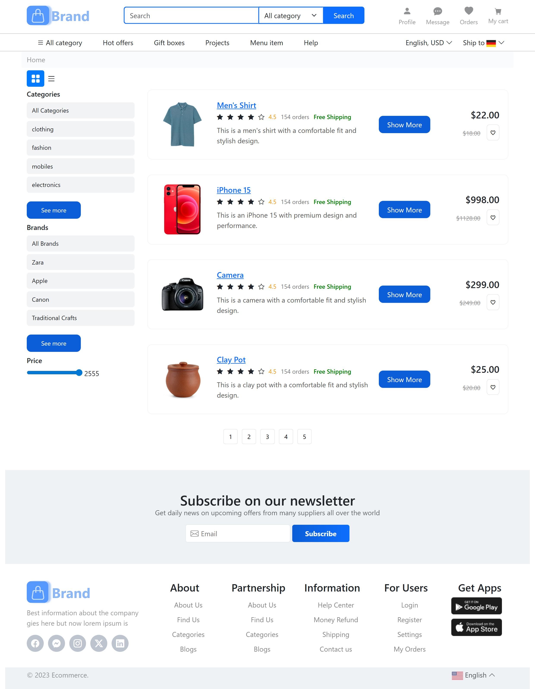

# Ecommerce Frontend Project

## About
This is a **practice ecommerce frontend project** inspired by websites like Alibaba.  
The project is built to demonstrate **UI/UX design, product categorization, and filtering functionality** using HTML, CSS, and JavaScript.

---

## Features
- **Responsive UI/UX Design**: Clean, modern layout compatible with all screen sizes
- **Product Listing**: Display products with images, title, price, and brand
- **Product Filtering**:
  - By **category**
  - By **brand**
  - By **price range**
- **Search Bar**: Search products by name
- **Interactive Buttons & Hover Effects**: Enhancing user experience
- **Grid & List View** (optional if implemented)
- **Mobile-first design** for responsive experience

---

## Tech Stack
- **HTML5**
- **CSS3** (Flexbox & Grid)
- **JavaScript** (Filtering & dynamic UI)

---

## Screenshots



---


## How to Run Locally
1. Clone this repository:
   ```bash
   git clone https://github.com/ZainAhmad393/developerhub.git
